# Case Study 1: Employee Sabotage

### Digital Forensics Examination Report

|                   |                                          |
| ----------------- | ---------------------------------------- |
| **Examiner**      | Iliya Dehghani                           |
| **Evidence Item** | USB drive disk image (`evidence.img`)    |
| **Case Type**     | Industrial espionage / employee sabotage |
| **Platform**      | Kali Linux                               |
| **Report Type**   | Digital forensics examination report     |

---

## 1. Introduction

### 1.1 Background

This report documents the forensic examination of a USB drive seized as part of an industrial espionage investigation. The investigation centers on Larry, a 28-year-old employee at an IT start-up, arrested for allegedly selling proprietary source code. Following a report from a colleague and subsequent action by management and law enforcement, Larry was apprehended and the relevant digital evidence — including the USB drive examined in this report — was secured.

The investigation focuses on analyzing the USB disk image at the raw hex level to determine whether Larry sold additional proprietary data beyond the application source code, and to identify any steps he took to conceal or alter information on the device.

### 1.2 Objectives

- Identify any other bidders involved in the purchase of the source code.
- Determine whether Larry sold any additional proprietary data besides the application source code.
- Document the processes used by the suspect to mask or hide files.
- Identify all recovered files and assess their relation to the case.
- Record the processes used by the investigator to examine each file thoroughly.

### 1.3 Tools Utilized

| Tool                    | Purpose                                                |
| ----------------------- | ------------------------------------------------------ |
| Ghex (GNOME Hex Editor) | Detailed examination of hexadecimal data               |
| `dd`                    | Disk image acquisition and file/data carving by offset |
| `xxd`                   | Printing hex values for manual analysis                |

### 1.4 Methodology

The analysis began by examining the Master Boot Record (MBR) to locate the start of the first partition. With this information, the boot sector of the FAT partition was identified. The investigation then progressed to the Root Directory, where each cluster associated with the directories was examined. During this process, several unaccounted-for clusters were discovered containing additional data pertinent to the case.

## 2. Analysis & Findings

### 2.1 USB Disk Image Overview

The SHA1 and MD5 hashes of the acquired `evidence.img` file were computed and confirmed to match the reference hashes provided for the case, establishing evidentiary integrity before analysis began.

[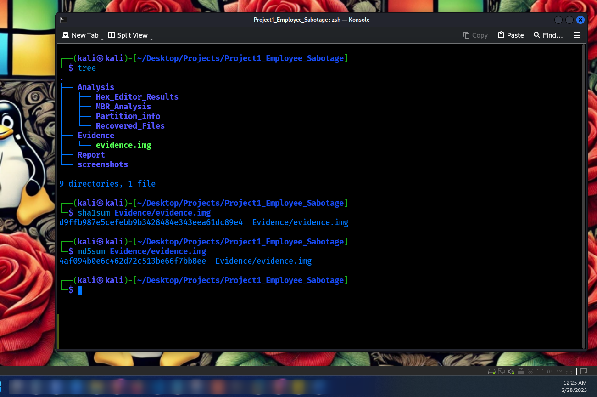](images/fig-01.png)
*Figure 1 — SHA1/MD5 hash of `evidence.img` confirmed matching the provided reference values.*

### 2.2 MBR Analysis & Partition Discovery

Examining the first 512 bytes (the Master Boot Record) revealed:

1. One partition present, not bootable (expected, as this is a USB drive image).
2. File system type byte `0x06`, indicating FAT16.
3. Starting LBA address: **2048**.
4. Partition size: **1,638,400 sectors**.

[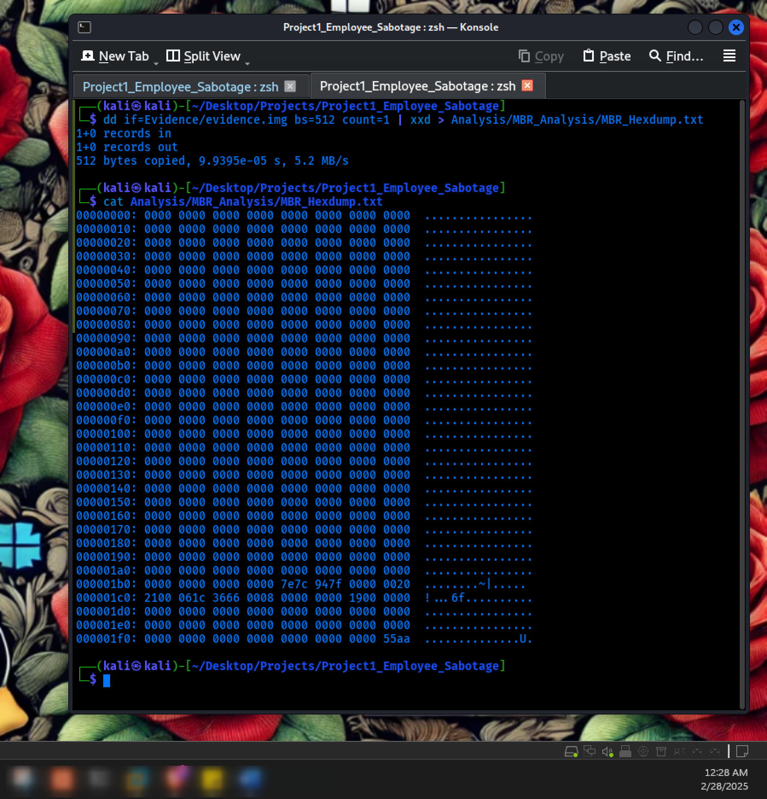](images/fig-02.png)
*Figure 2 — MBR examination identifying the single, non-bootable partition and its FAT16 type byte.*

To locate the boot sector offset: `2048 × 512 = 1,048,576` bytes (decimal), converted to hex as `0x100000`. A backup boot sector was also located at `0x100C00` (sector 6 of the partition, per the BPB field below: `0x100000 + 6 × 512 = 0x100C00`).

### 2.3 File System & Root Directory Examination

Jumping to the boot sector offset revealed the BIOS Parameter Block (BPB):

- **OEM Name:** `mkfs.fat` — a Linux CLI utility for creating FAT file systems, suggesting a possible reformat attempt.
- **Bytes per sector:** 512
- **Sectors per cluster:** 8
- **Reserved sectors:** 32
- **Number of FATs:** 2
- **Root entry count:** 0 — expected for FAT32 (root directory stored as a cluster chain rather than a fixed area); this value would be nonzero under FAT16, providing a second indicator that this partition, despite the MBR's `0x06` type byte, is actually **FAT32**.
- **16-bit total sectors:** 0 (signals the 32-bit field is authoritative)
- **Media descriptor:** `0xF8` (fixed disk)
- **16-bit FAT size:** 0 — a third indicator of FAT32 (the 32-bit FAT size field is used instead)
- **Sectors per track:** 63; **Number of heads:** 255
- **Hidden sectors:** 2,048 (sectors before the start of the partition — a possible sign of hidden data)
- **Total sectors (32-bit):** 1,638,378
- **FAT size (32-bit):** 1,600 sectors per FAT
- **Root cluster:** 2
- **Volume label:** "NO NAME"; **File system type string:** "FAT32"

Note that the BPB's 32-bit total sector count (1,638,378) is 22 sectors smaller than the partition size reported by the MBR (1,638,400). This small discrepancy means the FAT32 volume does not fully occupy its partition — a detail that becomes relevant in Section 4.

[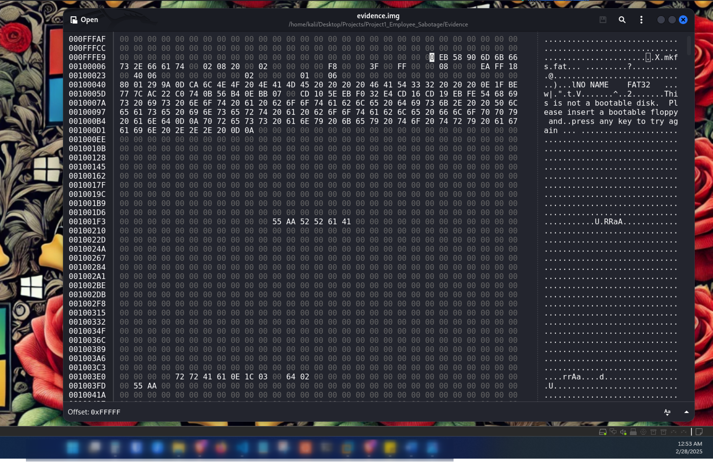](images/fig-03.png)
*Figure 3 — BIOS Parameter Block fields extracted from the boot sector, indicating FAT32 despite the MBR's FAT16 type byte.*

The full byte-level breakdown of these fields is documented in **Table 1** (Appendix).

[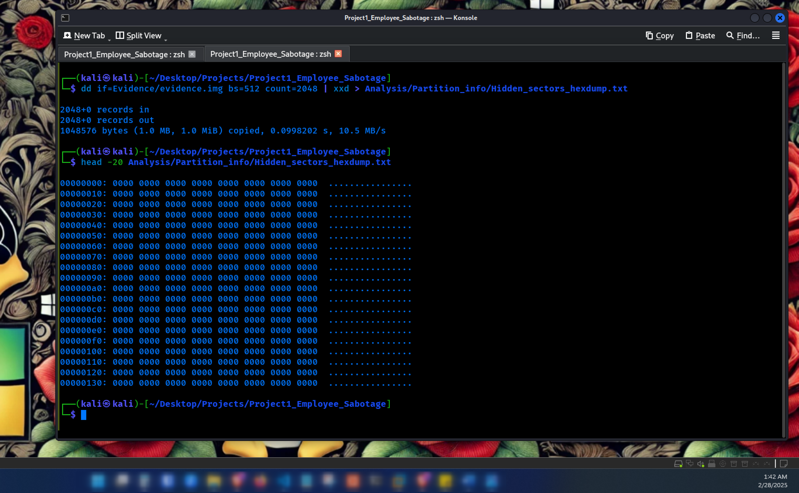](images/fig-04.png)
*Figure 4 — Continued BPB field analysis; the 2,048 hidden sectors preceding the partition were inspected and found to be entirely zeroed (empty).*

**Locating the first data area:**

**Cluster size:**

```
512 bytes/sector × 8 sectors/cluster = 4,096 bytes/cluster
```

**Data area start (absolute, from the beginning of the image):**

```
Hidden + Reserved + FATs = 2,048 + 32 + (2 × 1,600) = 5,280 sectors
Data area offset         = 5,280 × 512 = 2,703,360 bytes (0x294000)
```

The root directory data (starting at cluster 2) resembled a Windows user profile folder structure, suggesting a backup of a User folder had been placed on the USB drive.

[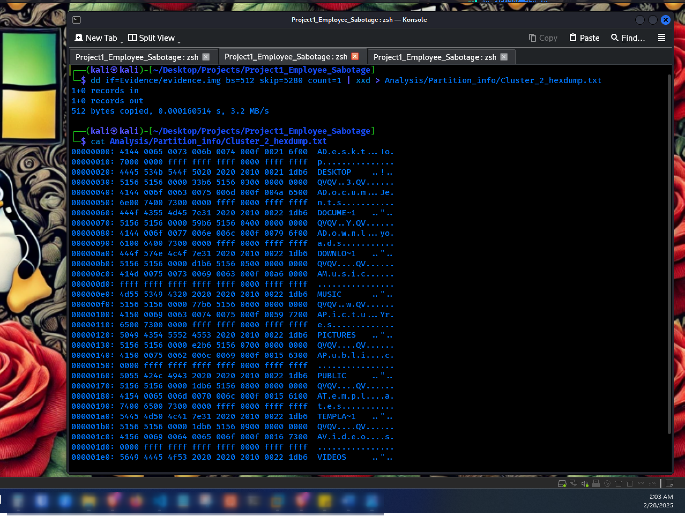](images/fig-05.png)
*Figure 5 — Root directory cluster contents resembling a standard Windows user folder layout (Desktop, Documents, Downloads, Music, Pictures, etc.).*

**General folder offset formula:**

```
Offset = 2,703,360 + (cluster # − 2) × 4,096
```

Example — the "Desktop" folder starts at cluster 3:

```
Desktop Offset = 2,703,360 + (3 − 2) × 4,096 = 2,707,456 (0x295000)
```

The full set of folder starting offsets is documented in **Table 2** (Appendix).

### 2.4 Directory Entry Examination

Applying the offset formula above, each subfolder of the root directory was examined in turn:

**Desktop folder** — hinted at the presence of a BASH file/script.

[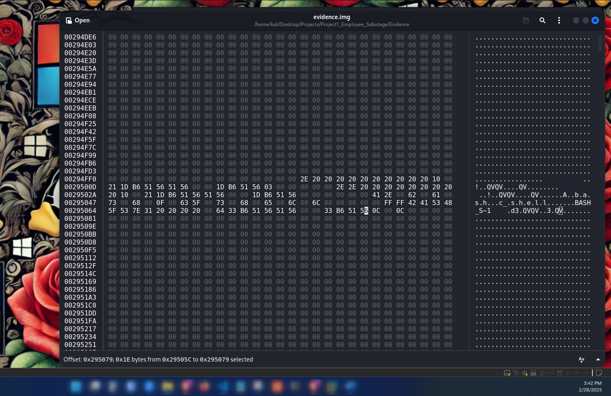](images/fig-06.png)
*Figure 6 — Desktop folder cluster contents, indicating a bash script entry.*

**Documents folder** — contained a JPG file, apparently named `SAVE_ME.jpg`/`save_me.jpg`.

[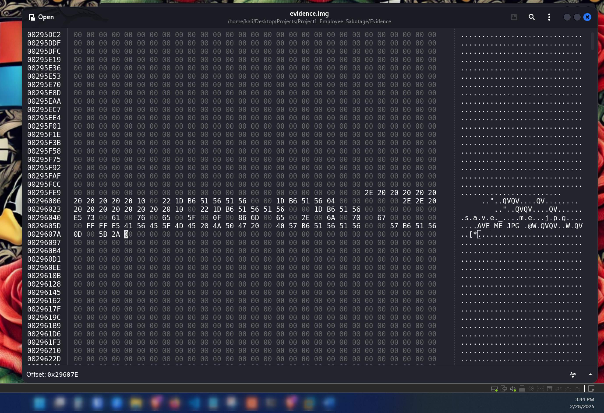](images/fig-07.png)
*Figure 7 — Documents folder cluster contents, revealing a JPG file entry.*

**Downloads folder** — revealed several notable fragments: a mention of the suspect "Larry," a `.doc` file reference, and a partial filename resembling "MESSAGE-1.DOC" or similar.

[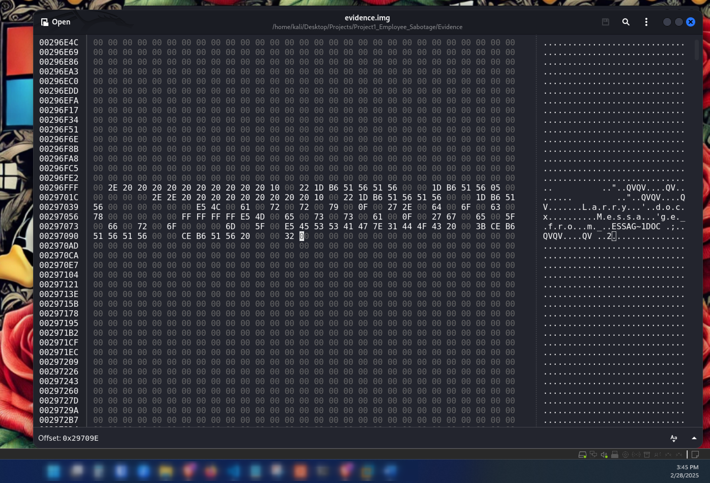](images/fig-08.png)
*Figure 8 — Downloads folder cluster contents, referencing "Larry" and a `.doc` file.*

**Music folder** — a filename fragment resembling `CATCH-1~.MP3` or similar.

[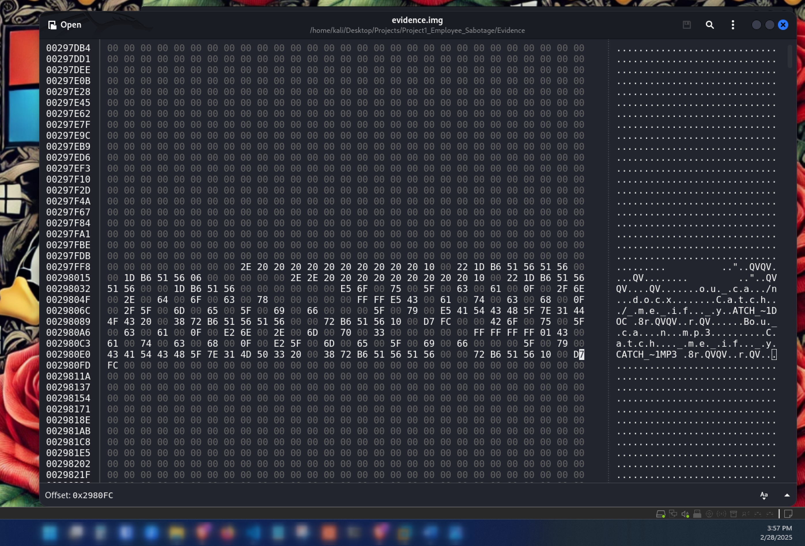](images/fig-09.png)
*Figure 9 — Music folder cluster contents, hinting at an MP3-named file entry.*

**Pictures folder** — partial filename fragments consistent with "TULIPS."

[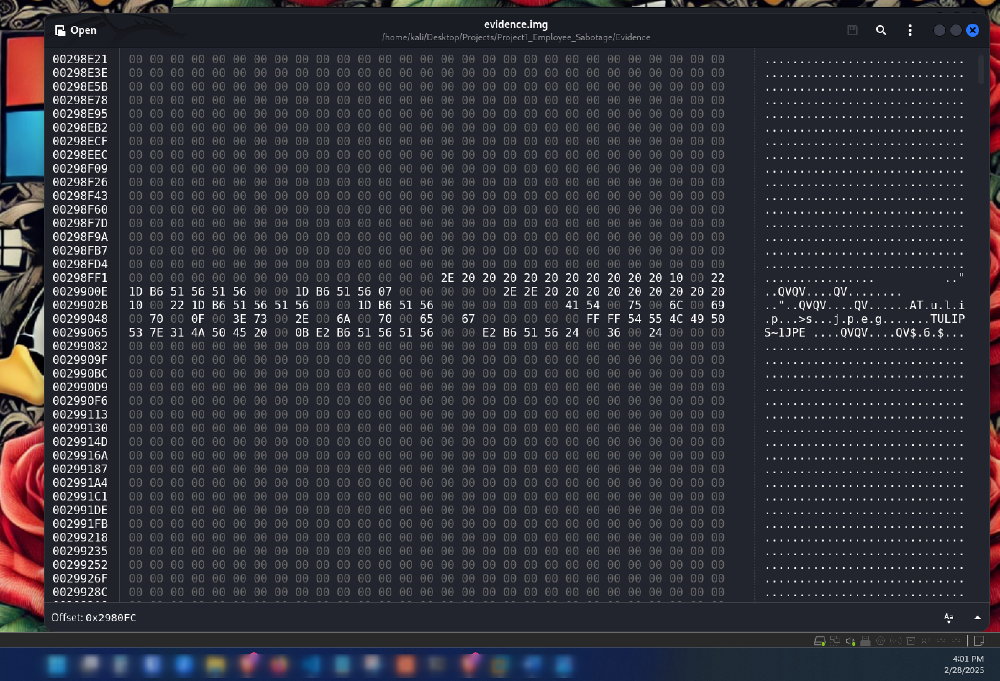](images/fig-10.png)
*Figure 10 — Pictures folder cluster contents, containing filename fragments consistent with "TULIPS."*

**Public** and **Templates** folders — both examined and found empty of relevant content.

[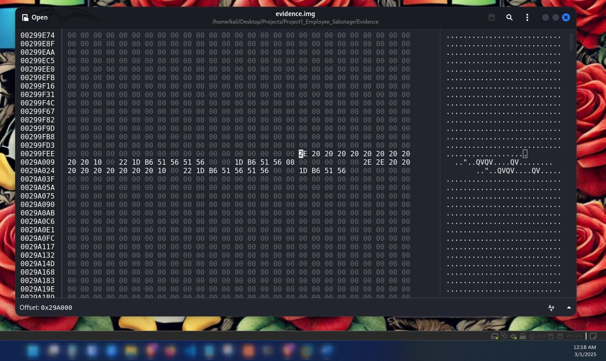](images/fig-11.png)
*Figure 11 — Public folder contents, found empty.*

[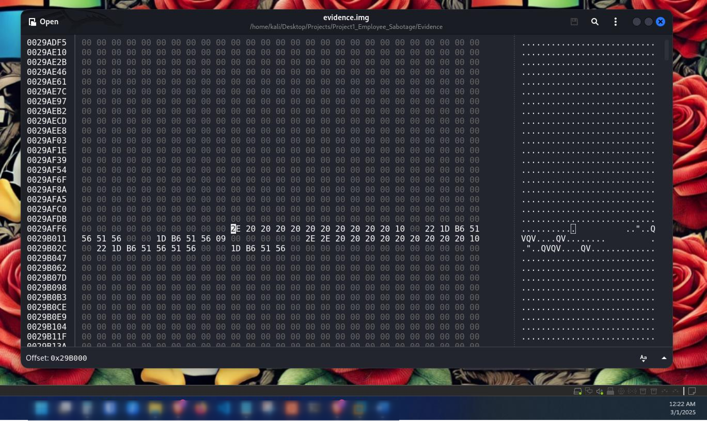](images/fig-12.png)
*Figure 12 — Templates folder contents, found empty.*

**Videos folder** — likewise contained no stored data.

[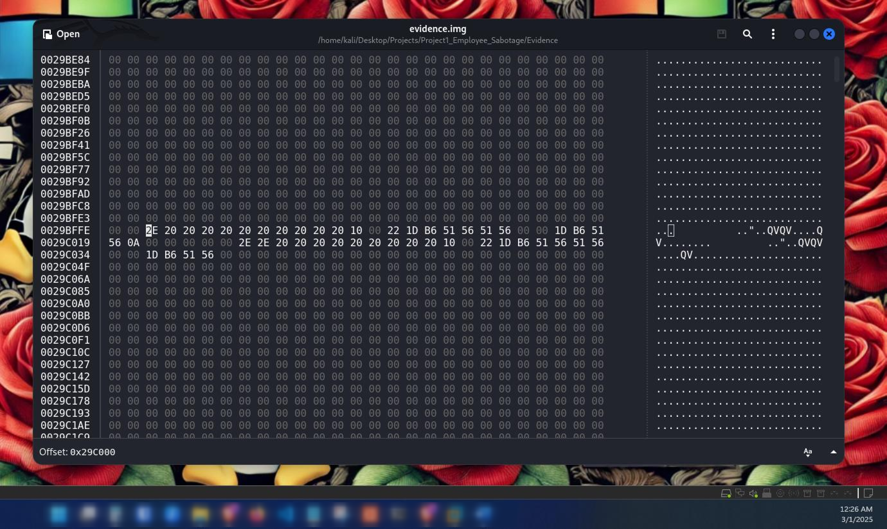](images/fig-13.png)
*Figure 13 — Final root subfolder (Videos), also found empty.*

**Resolving the bash file's cluster:** the short directory entry `BASH_S~1` in the Desktop folder specified a starting cluster split across a high word (`0x0000`) and low word (`0x000C`, decimal 12), placing the file at cluster 12:

```
Offset = 0x294000 + (12 − 2) × 0x1000 = 0x29E000
```

[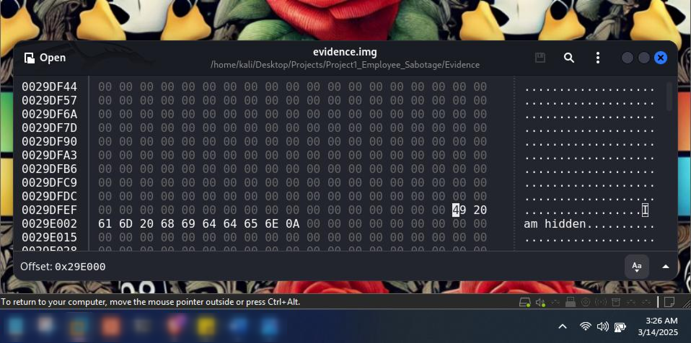](images/fig-14.png)
*Figure 14 — Directory entry cluster fields resolved to compute the bash file's absolute offset.*

Reading this offset revealed the bash file's content: **"I am hidden."** The same offset-resolution methodology was applied to locate and extract each remaining file of interest.

[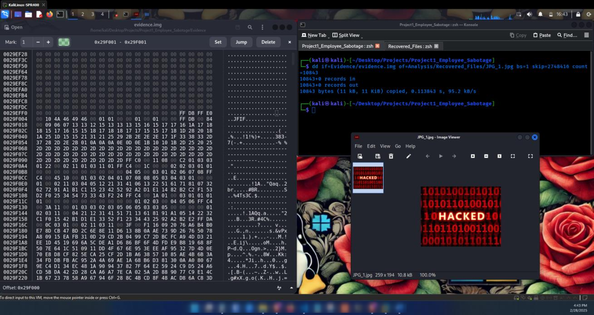](images/fig-15.png)
*Figure 15 — Recovered bash file content: "I am hidden."*

## 3. File-by-File Analysis

### 3.1 `Save_me.jpg`

The file begins at offset `0x29F000` (cluster 13), confirmed by the JPG start-of-image signature (`FF D8`). The end-of-image trailer signature (`FF D9`) was used to determine the extraction boundary. The end offset recorded below (`0x2A1A5A`) is the address of the final byte of the trailer (the `D9` byte), so the inclusive size calculation adds 1:

```
Start offset = 0x29F000 = 2,748,416 (decimal)
End offset   = 0x2A1A5A = 2,759,258 (decimal, address of the final trailer byte D9)
Size         = (2,759,258 − 2,748,416) + 1 = 10,843 bytes
```

[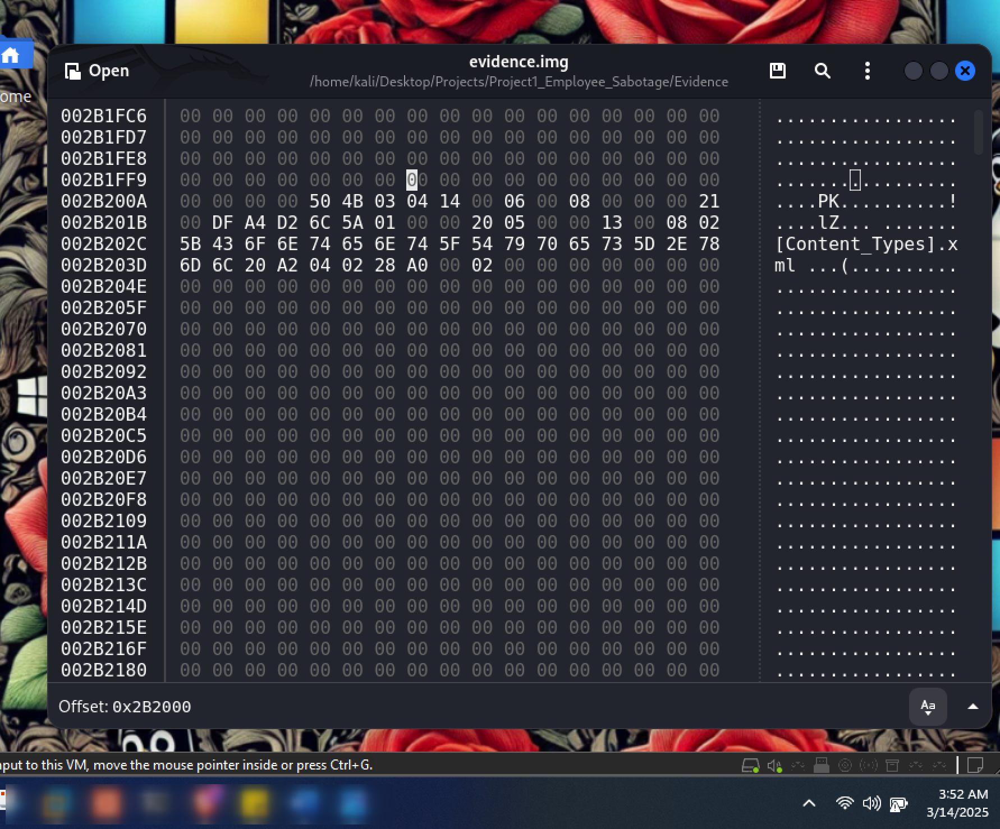](images/fig-16.png)
*Figure 16 — `Save_me.jpg` start/end signatures identified for `dd`-based extraction.*

### 3.2 `Message_from_Larry.doc`

Located in the Downloads folder, starting at offset `0x2B2000`, with the standard `.doc` end trailer used to bound the extraction.

[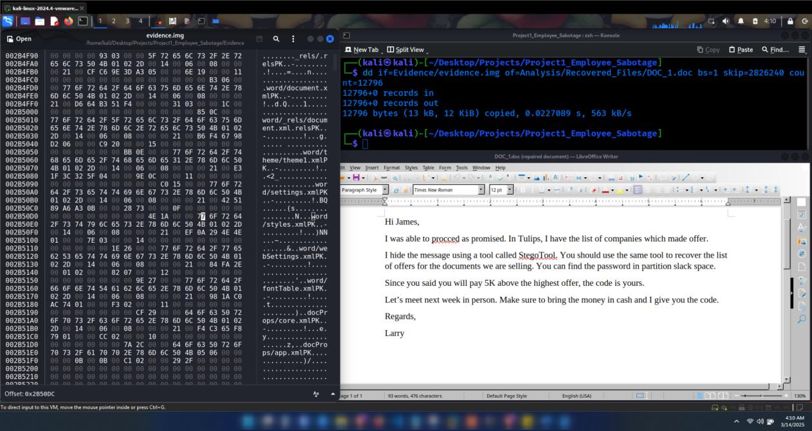](images/fig-17.png)
*Figure 17 — `Message_from_Larry.doc` start offset and trailer signature identified.*

Extraction via `dd` recovered the full document. Its contents were highly significant to the investigation: **Larry hid the list of companies that made purchase offers inside the "TULIPS" image file, with the extraction password located in the volume slack.**

### 3.3 `Catch_me_if_you_can`

Despite an `.mp3` extension in the directory entry, the file's actual signature identified it as a **ZIP archive** rather than an audio file — a clear attempt at file-type masking.

[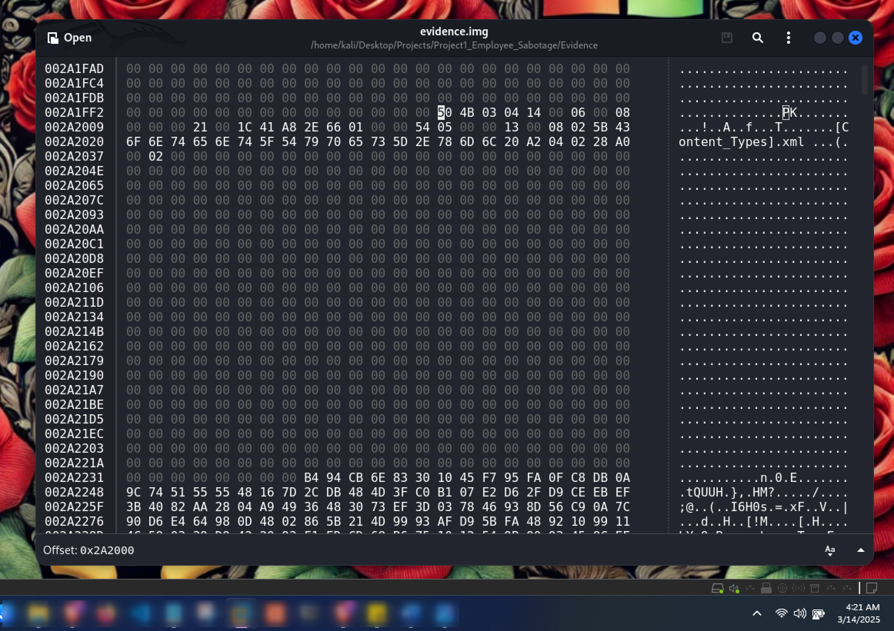](images/fig-18.png)
*Figure 18 — Directory entry claims an `.mp3` extension, but the file signature identifies a ZIP archive.*

The file's ending signature was located and the archive extracted via `dd`. Beyond confirming the masking technique, this file's contents were not otherwise relevant to the investigation.

[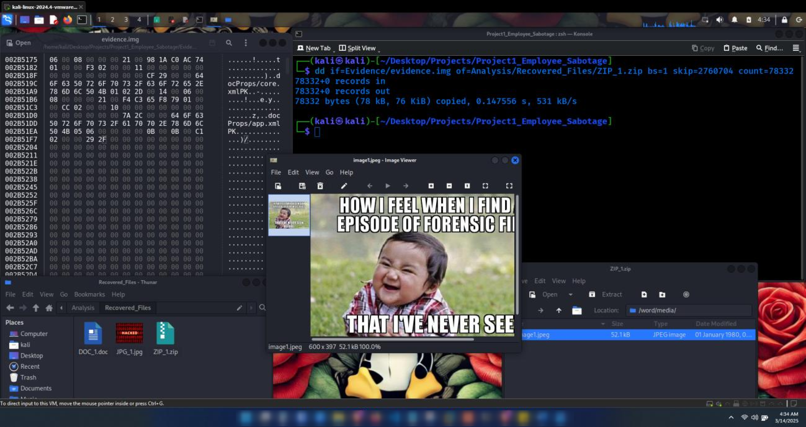](images/fig-19.png)
*Figure 19 — Extracted ZIP archive, confirming the deliberate extension mismatch.*

### 3.4 `TULIPS`

The directory entry suggested a JPG file, but the actual file signature identified a **BMP** image instead — a second instance of extension/type masking.

[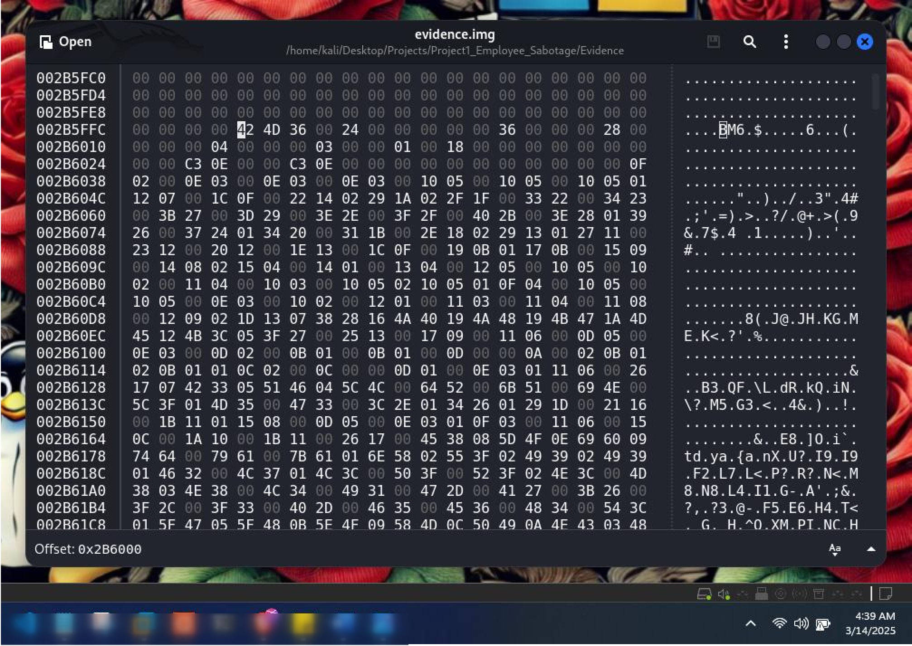](images/fig-20.png)
*Figure 20 — "TULIPS" directory entry (implying JPG) actually matches BMP file signatures.*

The BMP was extracted successfully, setting up the steganographic extraction described below.

[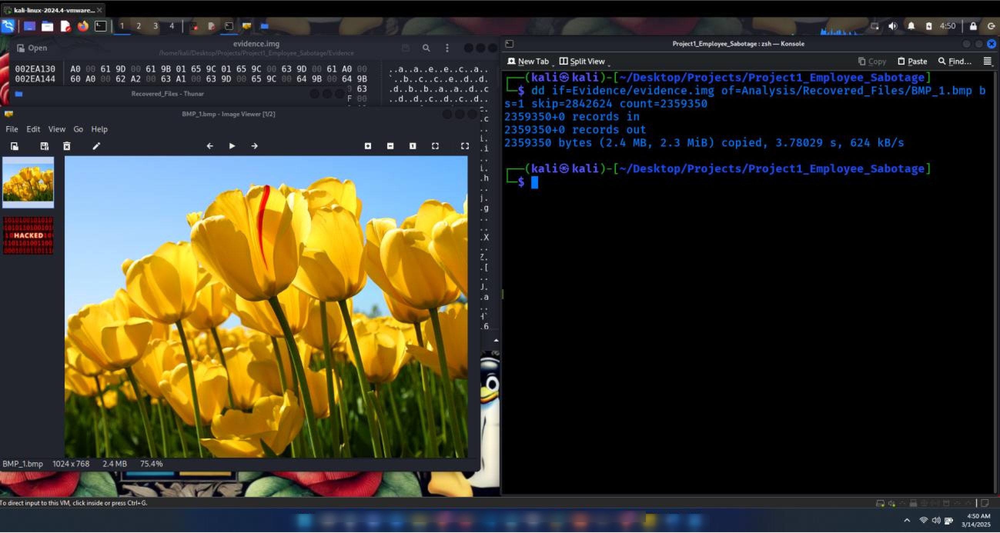](images/fig-21.png)
*Figure 21 — TULIPS BMP file successfully extracted via `dd`.*

## 4. TULIPS File Analysis — Steganography

Per `Message_from_Larry.doc`, the list of companies was hidden inside the TULIPS BMP file, with the extraction password stored in the "volume slack." Slack space, in general, is any region of the media that falls outside the area addressable by whole clusters of the file system's data area, and is therefore invisible to normal file-level inspection.

The acquired image was measured at **1,640,500 sectors (839,936,000 bytes)** — 52 sectors larger than the extent implied by the MBR (2,048 + 1,638,400 = 1,640,448 sectors), meaning the image captures additional media beyond the partition boundary. The slack region was located by finding the last whole-cluster boundary of the image:

```
Image size (measured):  1,640,500 sectors × 512 = 839,936,000 bytes
                        (image ends at 0x32106800)
Pre-data overhead:      Hidden + Reserved + FATs
                        = 2,048 + 32 + (2 × 1,600) = 5,280 sectors
Remaining area:         1,640,500 − 5,280 = 1,635,220 sectors
Whole clusters:         floor(1,635,220 ÷ 8) = 204,402 clusters
                        = 1,635,216 sectors
Residual slack:         1,635,220 − 1,635,216 = 4 sectors = 2,048 bytes
Slack offset:           (5,280 + 1,635,216) × 512 = 839,933,952 bytes
                        (0x32106000)
```

The slack region therefore occupies the final 2,048 bytes of the image, spanning `0x32106000`–`0x321067FF`.

**Note on terminology:** strictly speaking, this region lies beyond the FAT32 volume itself and beyond the MBR partition boundary. Per the BPB, the volume ends at sector 1,640,425 (2,048 + 1,638,378 − 1) and the partition ends at sector 1,640,447, while the recovered region spans sectors 1,640,496–1,640,499 — i.e., it sits in the unallocated tail of the acquired image, past the end of the partition. Larry's note referred to this hiding spot loosely as "volume slack"; it is more precisely described as slack space at the end of the imaged media. Either way, the location was validated empirically: reading from `0x32106000` revealed the symmetric extraction password, **`Pass23W0rd`**, which successfully decrypted the hidden payload.

[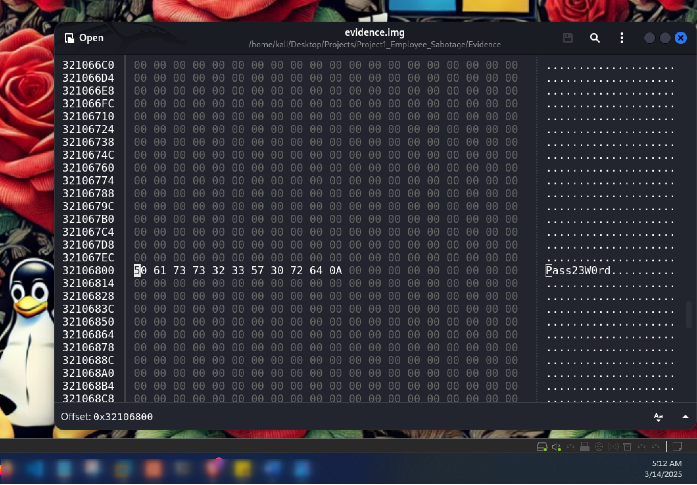](images/fig-22.png)
*Figure 22 — Slack space offset calculation, revealing the password `Pass23W0rd`.*

Using StegoTool with the recovered password against the TULIPS BMP file successfully extracted the hidden list of companies and their bid offers.

[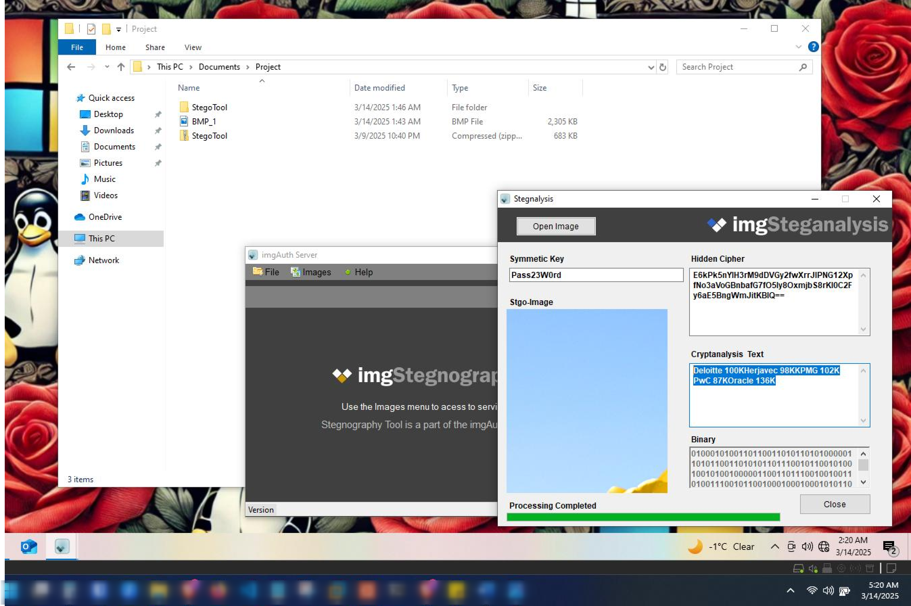](images/fig-23.png)
*Figure 23 — StegoTool output revealing the hidden list of companies and bid amounts extracted from the TULIPS BMP.*

## 5. Conclusion

Four files were successfully extracted and analyzed:

| Recovered File | Original / Reference Name | Notes                                                                    |
| -------------- | ------------------------- | ------------------------------------------------------------------------ |
| `BMP_1.bmp`    | TULIPS                    | Extension-masked (claimed JPG); contained steganographically hidden data |
| `DOC_1.doc`    | Message\_from\_Larry.doc  | Key evidence document                                                    |
| `ZIP_1.zip`    | Catch\_me\_if\_you\_can   | Extension-masked (claimed MP3); not directly relevant to the case        |
| `JPG_1.jpg`    | Save\_me.jpg              | Recovered without masking                                                |

**Key findings:** `DOC_1.doc` (`Message_from_Larry.doc`) reveals that Larry attempted to sell the proprietary source code to multiple companies and was prepared to finalize a sale. Using the password recovered from the slack space at the end of the image, a hidden list of prospective buyers and their offers was extracted from the TULIPS BMP file via steganography:

| Company  | Offer |
| -------- | ----- |
| Deloitte | $100K |
| Herjavec | $98K  |
| KPMG     | $102K |
| PwC      | $87K  |
| Oracle   | $136K |

These findings confirm that Larry actively solicited multiple buyers for the stolen source code and took deliberate measures — file extension masking and steganographic concealment — to hide his actions from casual inspection.

## Appendix

### Table 1 — Boot Sector Analysis

| Parameter              | Hex Value(s)                       | Interpretation / Value                                     |
| ---------------------- | ---------------------------------- | ---------------------------------------------------------- |
| Jump Instruction       | `EB 58 90`                         | Jump instruction transferring control to boot code         |
| OEM Name               | `6D 6B 66 73 2E 66 61 74`          | "mkfs.fat" — identifies the formatting utility             |
| Bytes per Sector       | `00 02`                            | 512 bytes (`0x0200`)                                       |
| Sectors per Cluster    | `08`                               | 8 sectors per cluster                                      |
| Reserved Sectors Count | `20 00`                            | 32 reserved sectors                                        |
| Number of FATs         | `02`                               | 2 FAT copies                                               |
| Root Entry Count       | `00 00`                            | 0 entries (FAT32 stores root directory in a cluster chain) |
| Total Sectors (16-bit) | `00 00`                            | 0 (indicates use of the 32-bit total sectors field)        |
| Media Descriptor       | `F8`                               | Fixed disk                                                 |
| FAT Size (16-bit)      | `00 00`                            | 0 (FAT32 uses the 32-bit FAT size field instead)           |
| Sectors per Track      | `3F 00`                            | 63 sectors per track                                       |
| Number of Heads        | `FF 00`                            | 255 heads (`0x00FF`)                                       |
| Hidden Sectors         | `00 08 00 00`                      | 2,048 hidden sectors (`0x00000800`)                        |
| Total Sectors (32-bit) | `EA FF 18 00`                      | 1,638,378 sectors (`0x0018FFEA`)                           |
| FAT Size (32-bit)      | `40 06 00 00`                      | 1,600 sectors per FAT (`0x00000640`)                       |
| Root Cluster           | `02 00 00 00`                      | Root directory starts at cluster 2                         |
| Backup Boot Sector     | `06 00`                            | Backup boot sector located at sector 6                     |
| Volume Label           | `4E 4F 20 4E 41 4D 45 20 20 20 20` | "NO NAME    " (11-byte label field)                        |
| File System Type       | `46 41 54 33 32 20 20 20`          | "FAT32   " — file system type identifier                   |

### Table 2 — Root Directory Cluster Analysis

| Folder (Short Name) | Starting Cluster | Absolute Offset |
| ------------------- | ---------------- | --------------- |
| DESKTOP             | 3                | `0x295000`      |
| DOCUME~1            | 4                | `0x296000`      |
| DOWNLO~1            | 5                | `0x297000`      |
| MUSIC               | 6                | `0x298000`      |
| PICTURE             | 7                | `0x299000`      |
| PUBLIC              | 8                | `0x29A000`      |
| TEMPLA~1            | 9                | `0x29B000`      |
| VIDEOS              | 10               | `0x29C000`      |

## Chain of Custody

| Time     | Date       | Action   | Location | Device          |
| -------- | ---------- | -------- | -------- | --------------- |
| 12:15 AM | 02/28/2025 | Started  | Home     | Personal Laptop |
| 2:10 AM  | 02/28/2025 | Paused   | Home     | Personal Laptop |
| 3:30 PM  | 02/28/2025 | Resumed  | Home     | Personal Laptop |
| 6:00 PM  | 02/28/2025 | Paused   | Home     | Personal Laptop |
| 7:30 PM  | 02/28/2025 | Resumed  | Home     | Personal Laptop |
| 1:55 AM  | 03/01/2025 | Paused   | Home     | Personal Laptop |
| 3:20 AM  | 03/14/2025 | Resumed  | Home     | Personal Laptop |
| 5:26 AM  | 03/14/2025 | Finished | Home     | Personal Laptop |

## References

[1] "FAT32 File Carving." [Online]. Available: <https://rorywag.gitbook.io/sleuthifer/digital-forensics/file-carving/fat32-file-carving>

[2] "File Signatures Table." University of Houston–Clear Lake. [Online]. Available: <https://sceweb.sce.uhcl.edu/abeysekera/itec3831/labs/FILE%20SIGNATURES%20TABLE.pdf>

[3] G. Kessler, "File Signatures." [Online]. Available: <https://www.garykessler.net/library/file_sigs.html>

[4] RapidTables, hex/decimal conversion utility. [Online]. Available: <https://www.rapidtables.com/>
