# Project 2: Rhino Hunt
### Digital Forensics Examination Report — DFRWS 2005 "Rodeo" Scenario

| | |
|---|---|
| **Examiner** | Iliya Dehghani |
| **Evidence Items** | `RHINOUSB.dd` (USB drive image), `rhino.log`, `rhino2.log`, `rhino3.log` (network traces) |
| **Case Type** | Suspected illegal possession/transmission of prohibited images |
| **Platform** | Kali Linux VM, Windows 10 Workstation VM |
| **Report Type** | Digital forensics examination report (includes supplemental steganography addendum) |

---

## 1. Introduction

### 1.1 Purpose

To investigate suspected illegal possession and transmission of rhinoceros images, per the 2004 New Orleans ordinance referenced in the DFRWS 2005 "Rodeo" case scenario.

### 1.2 Incident Overview

RHINOVORE flagged unusual activity on a university computer. The machine's hard drive was missing at the time of seizure, but a USB drive image and three network packet captures were recovered and provided for analysis.

### 1.3 Evidence Summary

Analysis was conducted in parallel across a Kali Linux VM and a Windows 10 Workstation VM (via WSL/Ubuntu), with hash integrity of every evidence file confirmed independently in both environments before analysis began.

| Evidence Item | Description | MD5 Hash |
|---|---|---|
| `RHINOUSB.dd` | USB drive image | `80348c58eec4c328ef1f7709adc56a54` |
| `rhino.log` | Network trace 1 | `c0d0093eb1664cd7b73f3a5225ae3f30` |
| `rhino2.log` | Network trace 2 | `cd21eaf4acfb50f71ffff857d7968341` |
| `rhino3.log` | Network trace 3 | `7e29f9d67346df25faaf18efcd95fc30` |

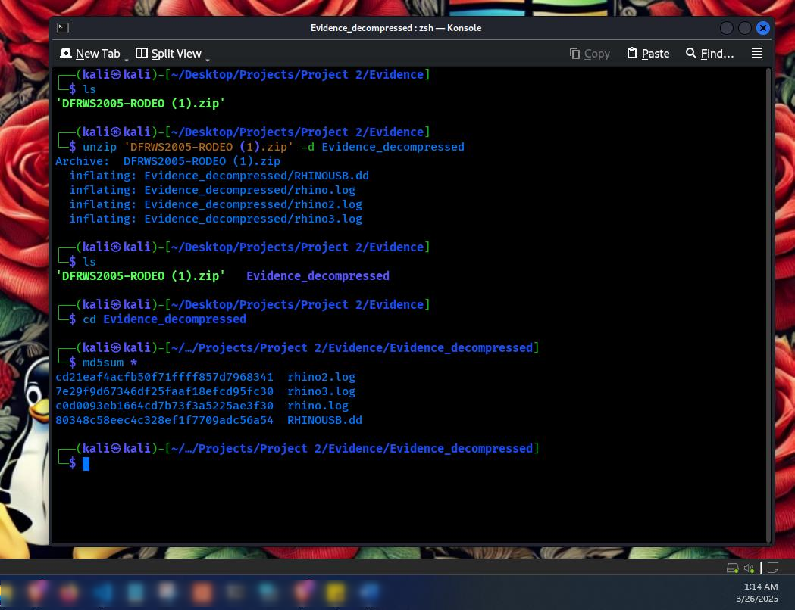
*Figure 1 — MD5 hash integrity confirmed for `RHINOUSB.dd`, `rhino.log`, `rhino2.log`, and `rhino3.log` in the Kali Linux environment.*

Hash integrity was independently re-confirmed in the Windows 10 Workstation (Ubuntu WSL) environment for redundancy.

## 2. USB Key Image Analysis

| | |
|---|---|
| **File name** | `RHINOUSB.dd` |
| **File size** | 247 MB |
| **File system type** | FAT16 |
| **Tools used** | `fsstat`, Autopsy, Scalpel (two independent carving tools used for cross-validation) |
| **Activity range (per Autopsy)** | 04/29/2004 – 08/08/2005 |

**File system layout (sectors):**

| Region | Range |
|---|---|
| Total range | 0 – 506,847 |
| Reserved | 0 – 0 |
| Boot sector | 0 |
| FAT 0 | 1 – 248 |
| FAT 1 | 249 – 496 |
| Data area | 497 – 506,847 |
| Root directory | 497 – 528 |
| Cluster area | 529 – 506,840 |
| Non-clustered | 506,841 – 506,847 |

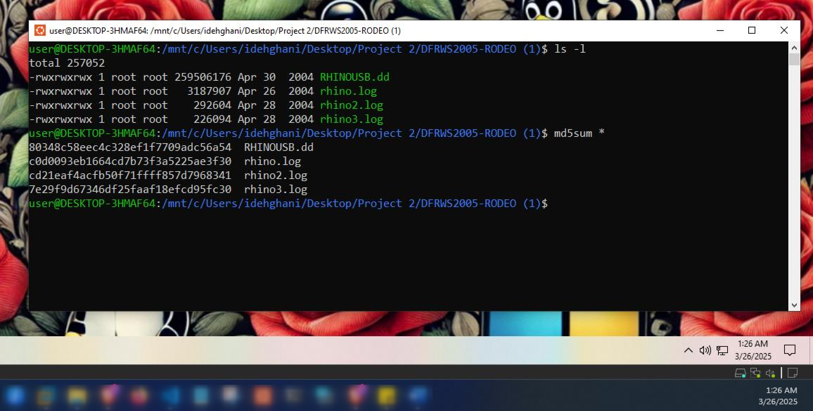
*Figure 2 — `fsstat` output confirming FAT16 layout and sector ranges for `RHINOUSB.dd`.*

### 2.1 Rhino Image Recovery from USB — Scalpel

Scalpel was run in the Kali Linux environment using a configuration predefined to carve JPG/GIF signatures from the raw image.

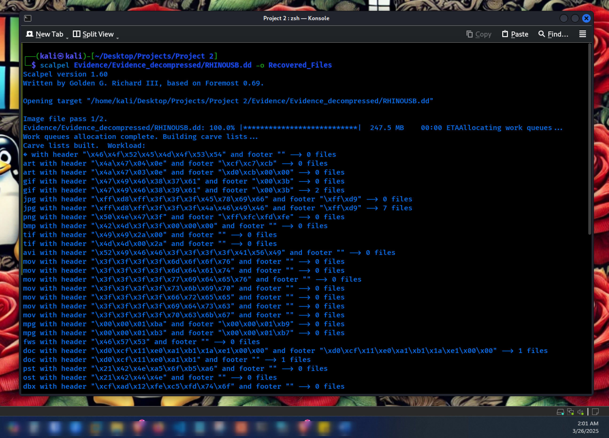
*Figure 3 — Scalpel configured and executed against `RHINOUSB.dd`.*

Scalpel reported successfully carving **161 files** total, including a total of **four rhino images** and **five alligator images** (JPG/GIF).

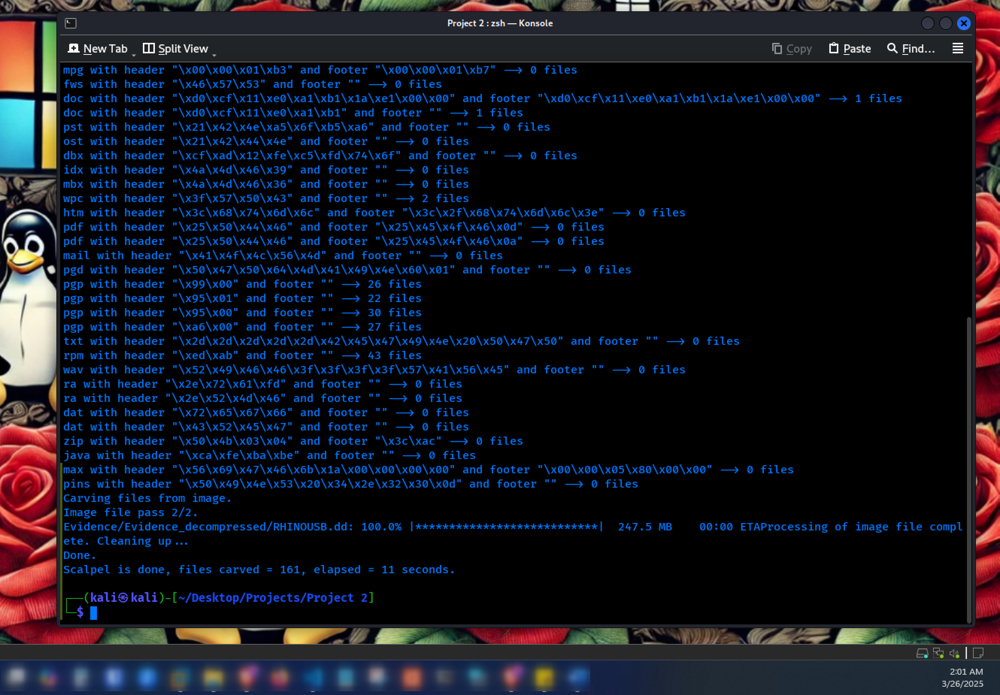
*Figure 4 — Scalpel carving summary, reporting 161 total files recovered.*

### 2.2 Rhino Image Recovery from USB — Autopsy

For cross-validation, the same image was independently processed with **Autopsy** in the Windows 10 Workstation environment, recovering the identical set of JPG and GIF images as Scalpel — confirming the carving results were tool-independent.

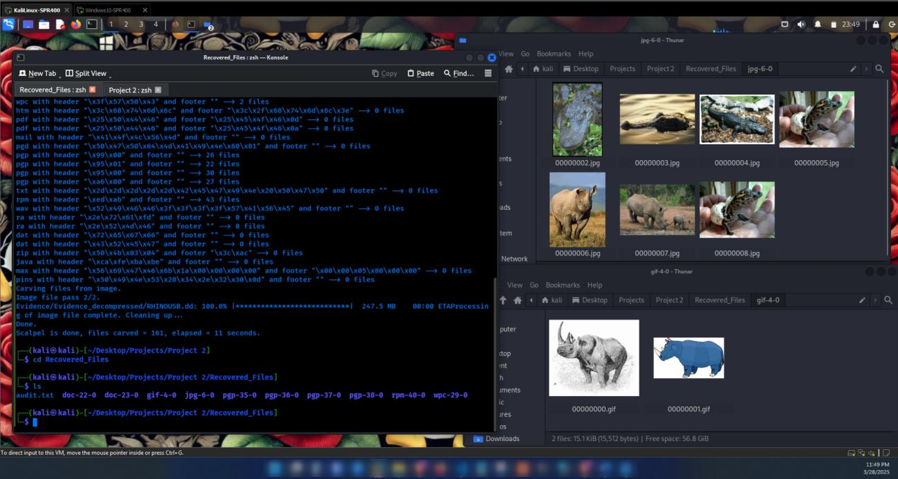
*Figure 5 — Four rhino images and five alligator images recovered via Scalpel.*

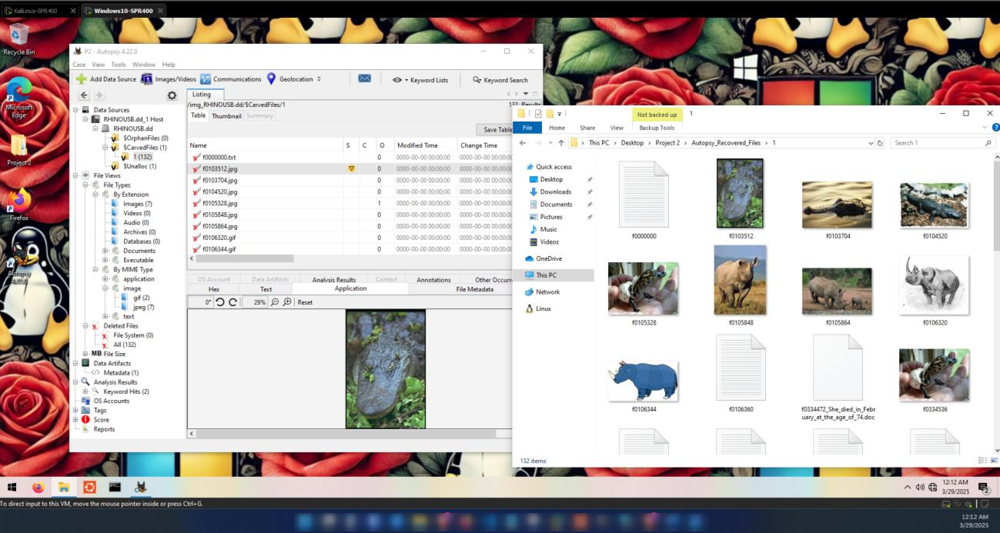
*Figure 6 — Autopsy independently recovering the same GIF/JPG image set as Scalpel.*

### 2.3 Image Analysis with Autopsy

Autopsy successfully ingested `RHINOUSB.dd` and reported on file system type, activity timeline, and file inventory: **1 directory, 2 allocated files, 133 unallocated files, and 2 slack files** were identified, including the previously reported JPG/GIF images.

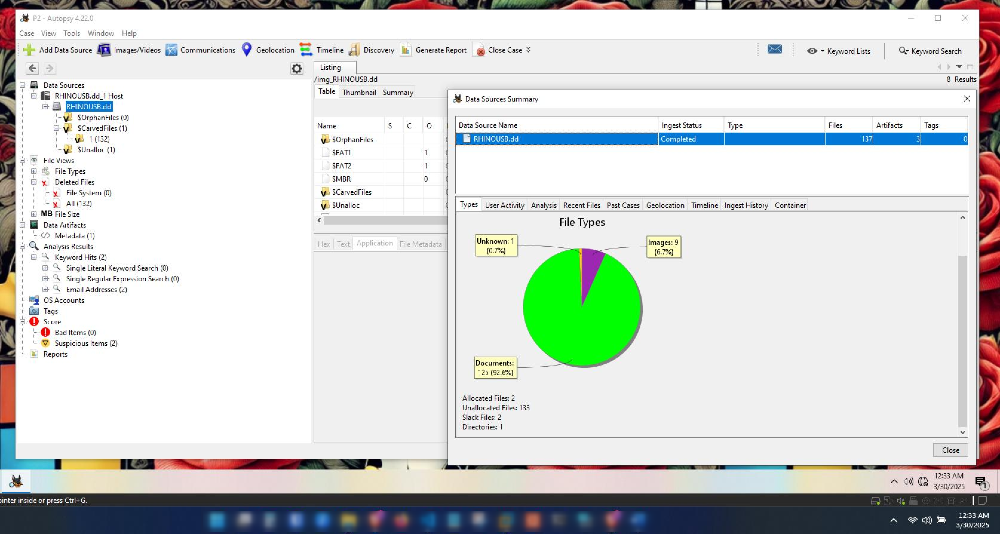
*Figure 7 — Autopsy case ingestion summary: file system details, directory/file counts, and activity timeline.*

Among the recovered files, a document named `f0334472_She_died_in_February_at_the_age_of_74.doc` contained highly significant evidence: the suspect describing efforts to **hide photos of rhinos**, having **"zapped" their hard drive** and disposed of it in the Mississippi River, along with future plans to **format the USB drive** while preserving "the good stuff," and to change the password on a Gnome account provided by an individual named **Jeremy**.

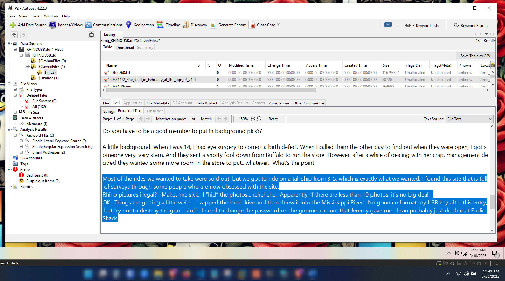
*Figure 8 — `f0334472_She_died_in_February_at_the_age_of_74.doc` content, describing hard drive destruction, USB reformatting plans, and a Gnome account tied to "Jeremy."*

## 3. Log Network Analysis

Wireshark on Kali Linux was used to analyze the three provided network packet captures. All recovered artifacts were submitted alongside this report.

### 3.1 PCAP File #1 — `rhino.log`

Protocol Hierarchy Statistics revealed a mix of web, email, file transfer, and legacy protocols: Telnet, FTP, and IMAP sessions alongside HTTP traffic.

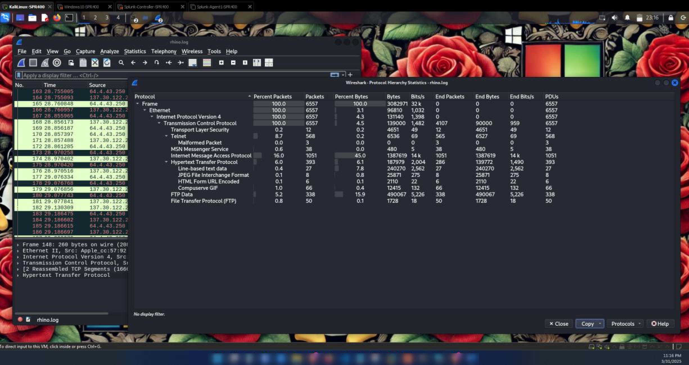
*Figure 9 — Protocol breakdown of `rhino.log`, showing Telnet, FTP, IMAP, and HTTP traffic.*

FTP traffic was identified with host `137.30.122.253`, which transmitted three rhino images and a ZIP archive.

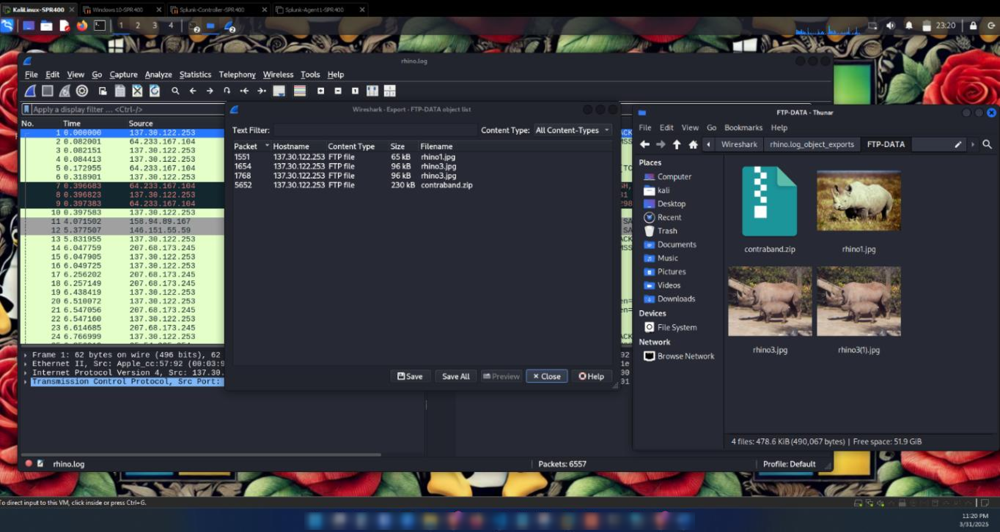
*Figure 10 — FTP session to `137.30.122.253` transferring three rhino images and `contraband.zip`.*

Using `john` on Kali, the password for `contraband.zip` was cracked and found to be **"monkey."** Decompressing the archive revealed a further piece of evidence: `rhino2.jpg`.

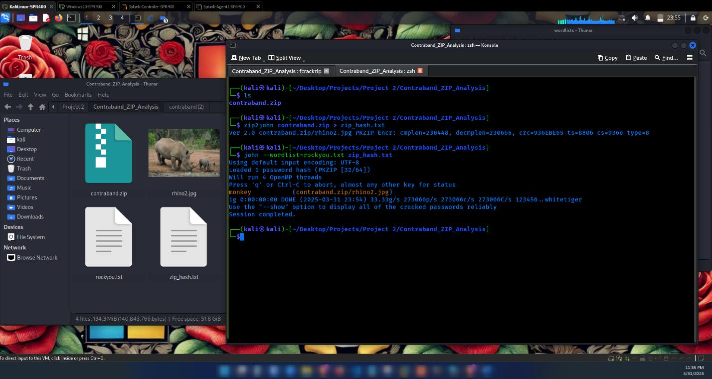
*Figure 11 — `contraband.zip` password (`monkey`) recovered via `john`, decompressing to reveal `rhino2.jpg`.*

Exporting HTTP objects from this capture did not yield any additional rhino images.

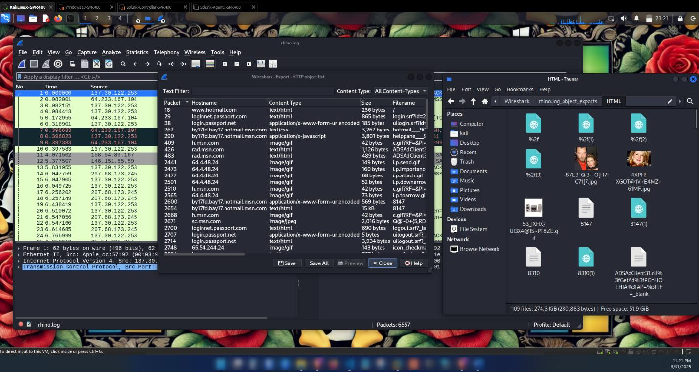
*Figure 12 — HTTP objects exported from `rhino.log`; no rhino images present in this protocol's traffic.*

#### Telnet

Filtering for Telnet traffic and following the TCP stream revealed:

| Field | Value |
|---|---|
| OS | SunOS 5.9 (Solaris), Sun Microsystems |
| Hostname | `cook` |
| Username | `gnome` |
| Password | `gnome123` |
| UID | 2287 |
| GID | 2000 (`cscistu`) |
| Login time | Mon Apr 26 17:17:36 CDT 2004 |
| Source IP | 137.30.122.253 |

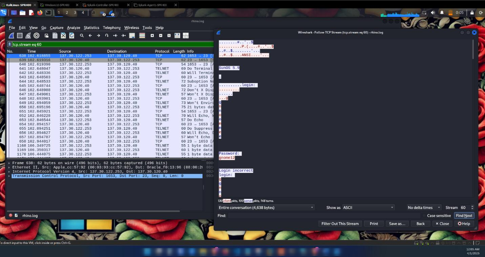
*Figure 13 — Telnet TCP stream showing the `gnome` account logging into host `cook` from `137.30.122.253`.*

The user `gnome` was observed accessing the Solaris system remotely from that external IP. An `ls` command revealed a file named `golden.jpg` and a list of other user accounts on the server. Two password change attempts (`gnome1234`, `gnome12345`) both failed with "Permission denied" errors, as neither met the system's password complexity requirements.

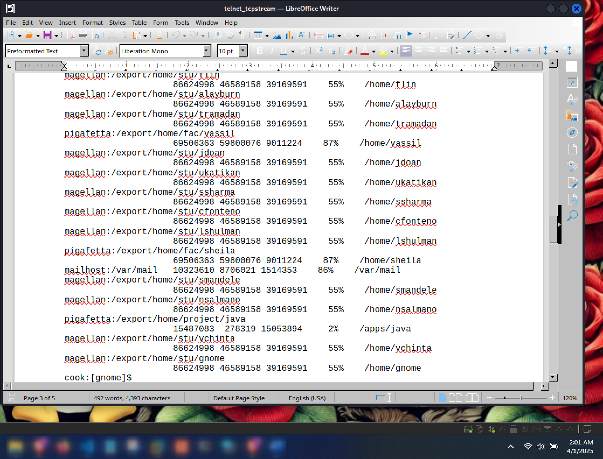
*Figure 14 — Additional user accounts enumerated from the Telnet TCP stream in `rhino.log`.*

#### IMAP (Internet Message Access Protocol)

The mailbox at `/var/mail/golden` was found to contain **11,292 emails, 9 unread**.

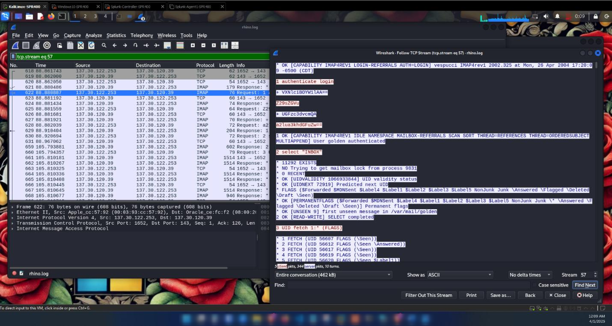
*Figure 15 — IMAP session revealing the `golden` mailbox path and message counts.*

Decoding base64-encoded authentication data in the IMAP stream revealed the credentials **`golden:kinky!tang`**.

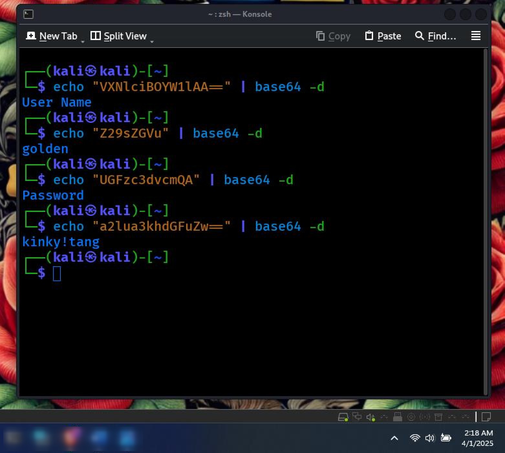
*Figure 16 — IMAP authentication data decoded from base64, revealing credentials `golden:kinky!tang`.*

#### FTP (File Transfer Protocol)

Three distinct FTP streams were identified within this capture.

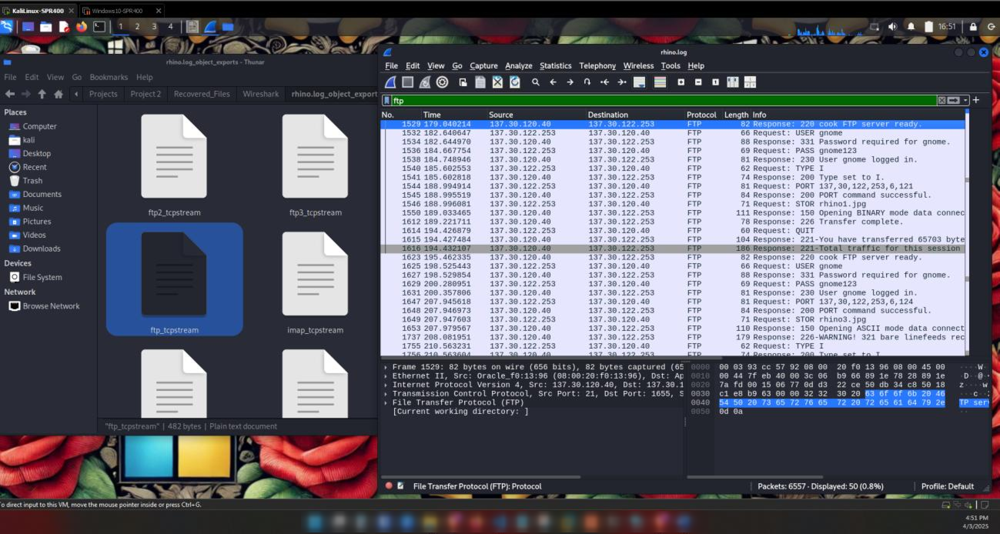
*Figure 17 — FTP protocol analysis identifying three distinct sessions within `rhino.log`.*

**FTP Stream #1:** the client logs in as `gnome` on host `cook` (password `gnome123`), sets binary transfer mode, and uploads `rhino1.jpg` via the `PORT` command. The transfer completes successfully and the session ends with a proper `QUIT`.

**FTP Stream #2:** the client initially uploads `rhino3.jpg` in **ASCII mode**, triggering a warning about potential corruption from bare linefeeds; recognizing the error, the client switches to **binary mode** and successfully re-uploads the file before terminating the session.

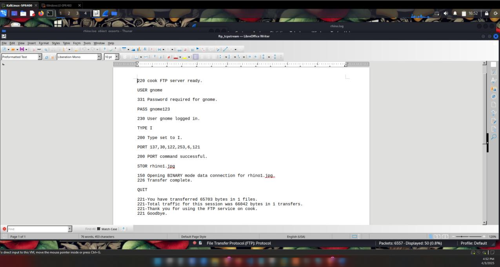
*Figure 18 — FTP Stream #1, uploading `rhino1.jpg` in binary mode.*

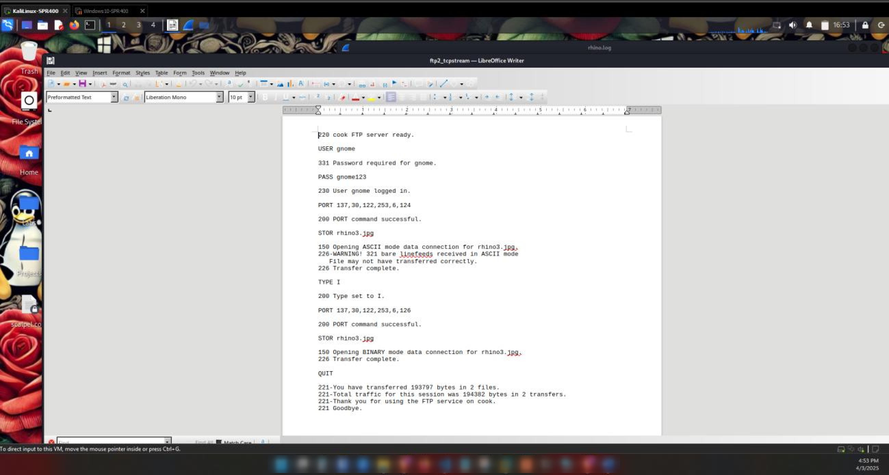
*Figure 19 — FTP Stream #2, showing the ASCII-to-binary mode correction and successful re-upload of `rhino3.jpg`.*

**FTP Stream #3:** the client sets binary mode from the start and uploads `contraband.zip` via the `PORT` command, concluding with standard transfer statistics and a `QUIT` command.

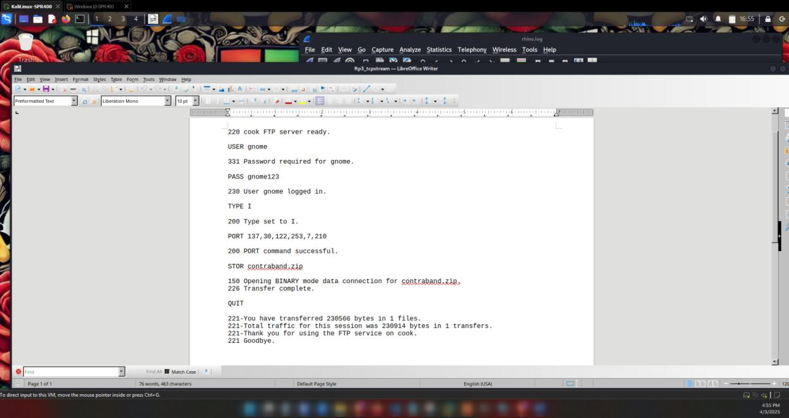
*Figure 20 — FTP Stream #3, uploading `contraband.zip` in binary mode from the start.*

#### MSNMS (MSN Messenger)

A separate stream appeared to represent part of a handshake or session keep-alive exchange with the Microsoft Messenger Network, referencing a product ID (`PROD0061VRRZH@4F`).

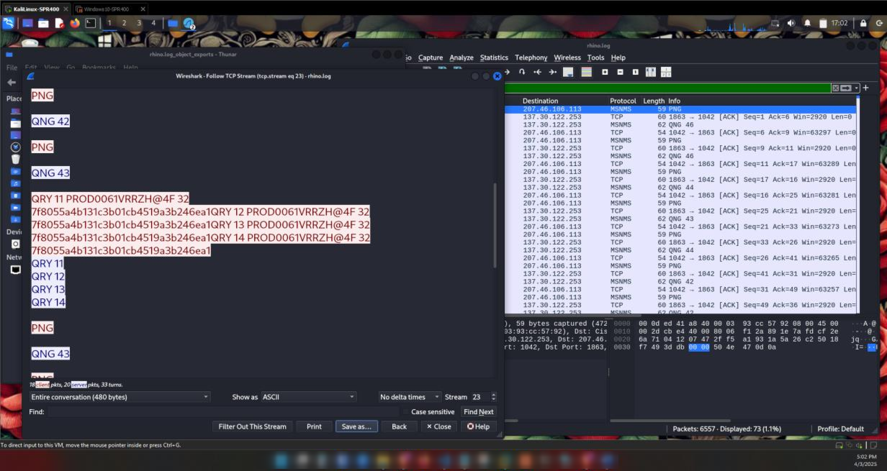
*Figure 21 — MSN Messenger protocol handshake/keep-alive traffic identified within the capture.*

### 3.2 PCAP File #2 — `rhino2.log`

The majority of traffic in this capture was IMAP (email) and HTTP carrying JPEG/GIF content.

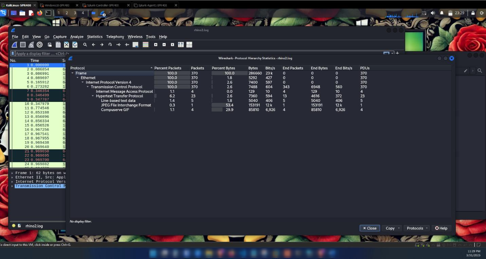
*Figure 22 — Protocol Hierarchy Statistics for `rhino2.log`, dominated by IMAP and HTTP traffic.*

Exporting HTTP objects from this capture recovered two additional rhino images: **`rhino4.jpg`** and **`rhino5.gif`**.

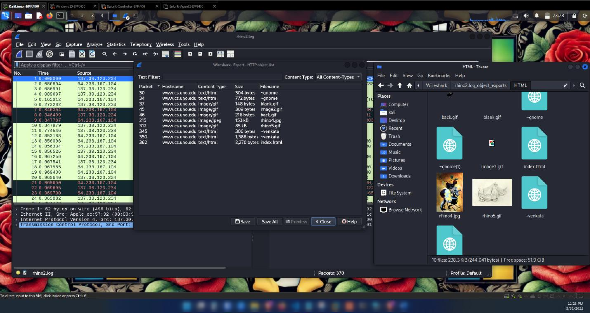
*Figure 23 — HTTP object export from `rhino2.log`, recovering `rhino4.jpg` and `rhino5.gif`.*

### 3.3 PCAP File #3 — `rhino3.log`

This capture again consisted primarily of IMAP traffic with some HTTP data.

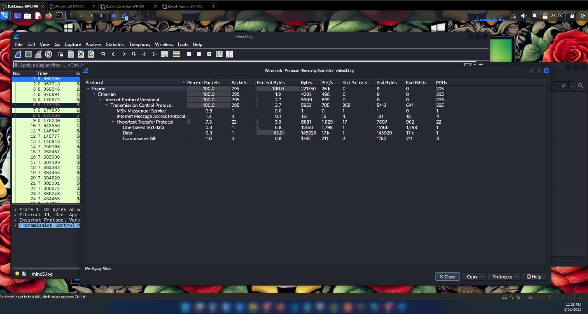
*Figure 24 — Protocol Hierarchy Statistics for `rhino3.log`.*

No rhino images were present in this capture; however, an **executable file** bearing a rhino-related name was identified — notable as a possible decoy or unrelated artifact rather than direct image evidence.

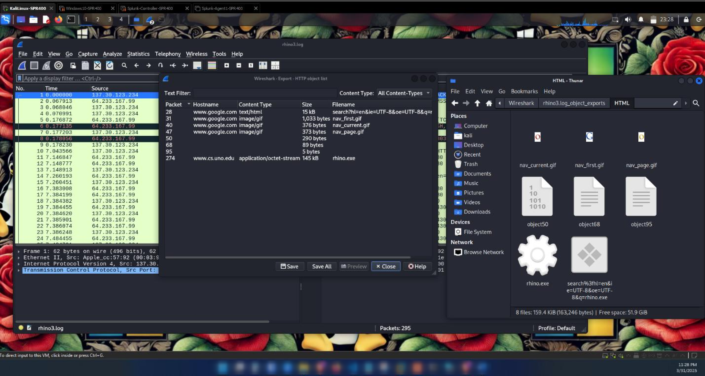
*Figure 25 — Executable file identified with a rhino-themed filename, containing no actual image data.*

## 4. Findings and Conclusion

The suspect was determined to be in possession of rhino photos exceeding the permitted number under the referenced ordinance. The complete set of recovered images is documented above, with each image's origin identifiable by filename convention: files beginning with multiple zeros originate from the USB image, while files containing "rhino" originate from the network logs.

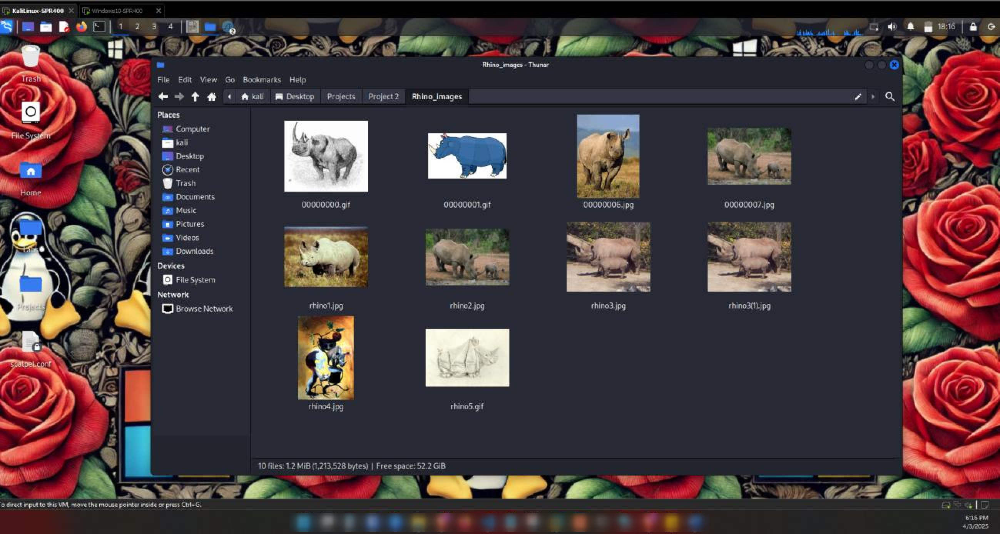
*Figure 26 — Full image inventory recovered across the USB drive image and all three network captures.*

**Two duplicate images were identified**, providing critical evidentiary links:

1. `rhino3.jpg` appears **twice** within the FTP traffic captured in `rhino.log` (uploaded once in ASCII mode with a corruption warning, then re-uploaded in binary mode).
2. `00000007.jpg` (carved from the USB image) and `rhino2.jpg` (recovered from `contraband.zip` within the FTP traffic) are **the same image** — directly linking the USB device to the network traces and establishing that the same evidence traveled through both channels.

The document recovered from the USB drive additionally names **"Jeremy"** as the individual who provided the suspect with FTP and Telnet access credentials (`gnome:gnome123`). Per the same document, the suspect attempted to destroy evidence by physically destroying ("zapping") the hard drive and disposing of it in the Mississippi River, and reformatted the USB key while deliberately preserving "the good stuff" — a clear reference to the rhino images ultimately recovered from that same device. Supporting artifacts consistent with an attempted USB reformat were also observed during file system analysis.

All recovered/extracted files from this investigation were submitted alongside this report.

## 5. Supplemental Submission: Evidence Linking and Steganography Analysis

*The following section documents a supplemental submission made after the initial report above, providing additional evidentiary support and an attempted steganography analysis of non-rhino images recovered from the USB drive.*

### 5.1 Evidence Connecting the USB Drive to Network Traffic

To directly substantiate the USB-to-network evidentiary link summarized in Section 4, matching MD5 hash values were computed for `00000007.jpg` (recovered by Scalpel from the USB image) and `rhino2.jpg` (recovered via Wireshark from the network logs), confirming they are byte-for-byte identical files.

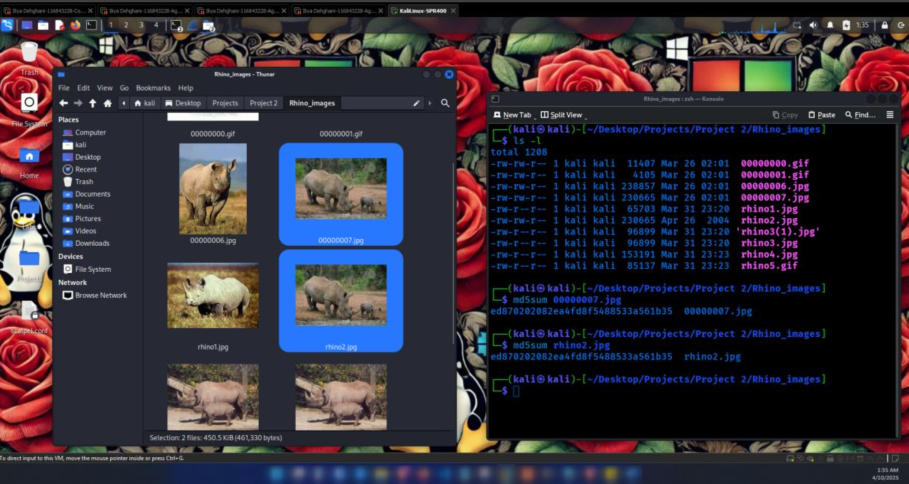
*Figure 27 — MD5 hash comparison confirming `00000007.jpg` (USB) and `rhino2.jpg` (network/FTP) are the identical file.*

### 5.2 Steganography Analysis

The non-rhino images recovered from the USB image were also examined for potential steganographic content, since the suspect's own document referenced hiding "the good stuff." Hash values for these images were confirmed against the reference values provided in the case's step-by-step instructional material.

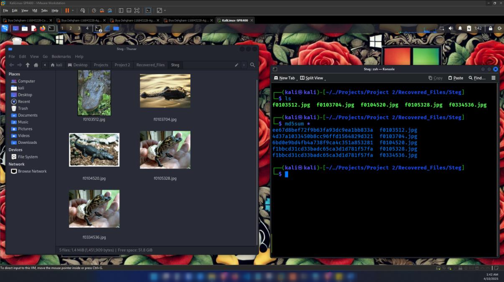
*Figure 28 — Additional (non-rhino) images recovered from `RHINOUSB.dd`, hash-verified against the provided reference values.*

Using `exiftool` to inspect image metadata, one file — `f0103512.jpg` (MD5 `ee67d8bef72f9b63fa93dc9ea1bb833a`) — stood out as suspicious: its X and Y resolution values were both set to **0**, which is not a valid state for an unmodified image file and strongly suggests the file had been altered, potentially to accommodate embedded steganographic data.

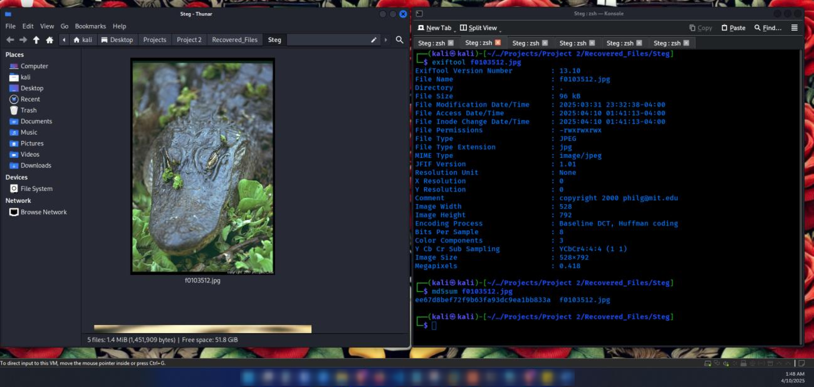
*Figure 29 — `exiftool` output for `f0103512.jpg` showing anomalous zeroed resolution metadata, consistent with file modification.*

**Tooling limitations encountered:** significant effort was spent attempting to run the steganography detection/extraction tools referenced in the case's step-by-step guide (`stegdetect`, `stegbreak`) on a current Kali Linux VM, without success — these tools appear to be effectively unmaintained (last updated in 2019 per their GitHub repository) and would not compile per the guide's own instructions, which explicitly note compatibility only with **Ubuntu 16.04 and 18.04** — both considerably older than the current Kali release used for this analysis.

*Figure 30 — Build failures encountered attempting to compile `stegdetect`/`stegbreak` on a modern Kali Linux environment.*

As an alternative, the newer `stegcracker` tool was attempted using the case-relevant candidate passphrases "gumbo" and "gator," but did not successfully extract any embedded data from the suspicious JPG files — an issue that appeared related to a `rules.ini` configuration file not integrating correctly with `stegcracker` in this environment.

**Assessment:** while `f0103512.jpg`'s anomalous metadata strongly suggests deliberate modification consistent with steganographic concealment, this could not be conclusively confirmed within this engagement due to the unavailability of functional, properly configured extraction tooling. This is documented as an open item — a finding supported by strong circumstantial (metadata) evidence, but not by successful direct extraction.

## Chain of Custody

| Time | Date | Status | Location | Device |
|---|---|---|---|---|
| 01:05 AM | 03/26/2025 | Started | Home | Personal Laptop |
| 02:07 AM | 03/26/2025 | Paused | Home | Personal Laptop |
| 11:45 PM | 03/28/2025 | Resumed | Home | Personal Laptop |
| 12:15 AM | 03/29/2025 | Paused | Home | Personal Laptop |
| 12:35 AM | 03/30/2025 | Resumed | Home | Personal Laptop |
| 01:00 AM | 03/30/2025 | Paused | Home | Personal Laptop |
| 11:00 PM | 03/31/2025 | Resumed | Home | Personal Laptop |
| 02:20 AM | 04/01/2025 | Paused | Home | Personal Laptop |
| 04:45 PM | 04/03/2025 | Resumed | Home | Personal Laptop |
| 06:15 PM | 04/03/2025 | Completed | Home | Personal Laptop |

## Video Demonstration

A recorded walkthrough of this analysis is available at the links below (primary and backup):

- Primary: https://youtu.be/nBT7zTfMFPA
- Backup: https://mega.nz/file/Hzg3FTyB#hD-jGaqlLV7WVYKmhf3_M8-uICS_yJKWJ18JKWbjTUY

## References

[1] "Scalpel." Kali Linux Tools. [Online]. Available: https://www.kali.org/tools/scalpel/

[2] "Using Wireshark: Exporting Objects from a Pcap." Palo Alto Networks Unit 42. [Online]. Available: https://unit42.paloaltonetworks.com/using-wireshark-exporting-objects-from-a-pcap/

[3] T. Cool, "Autopsy Tutorial for Digital Forensics." [Online]. Available: https://medium.com/@tusharcool118/autopsy-tutorial-for-digital-forensics-707ea5d5994d
